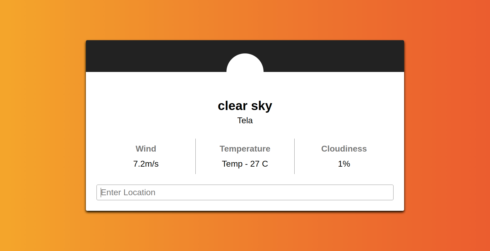

# Weather App

### This is a weather app, where you can see the wind speed, temperature and cloudiness for the city you search

### Built with
- JavaScript Vanilla
- HTML5 
- CSS3
- Openweathermap API
- Webpach

#### Livedemo
- [GitHub Pages]()

## Getting started
- run `git clone https://github.com/Ceci007/weather-app.git`;
- run `npm install`
- run `npm run build`
- open `dist/index.html` with you favorite browser.

## Author
👤 [Cecilia Benitez](https://github.com/Ceci007)

## Contributing

Contributions, issues and feature requests are welcome!

Feel free to check the [issues page](https://github.com/Ceci007/weather-app/issues)

## Show your support

Give a star if you like this project!

## 📝 License

This project is MIT licensed.